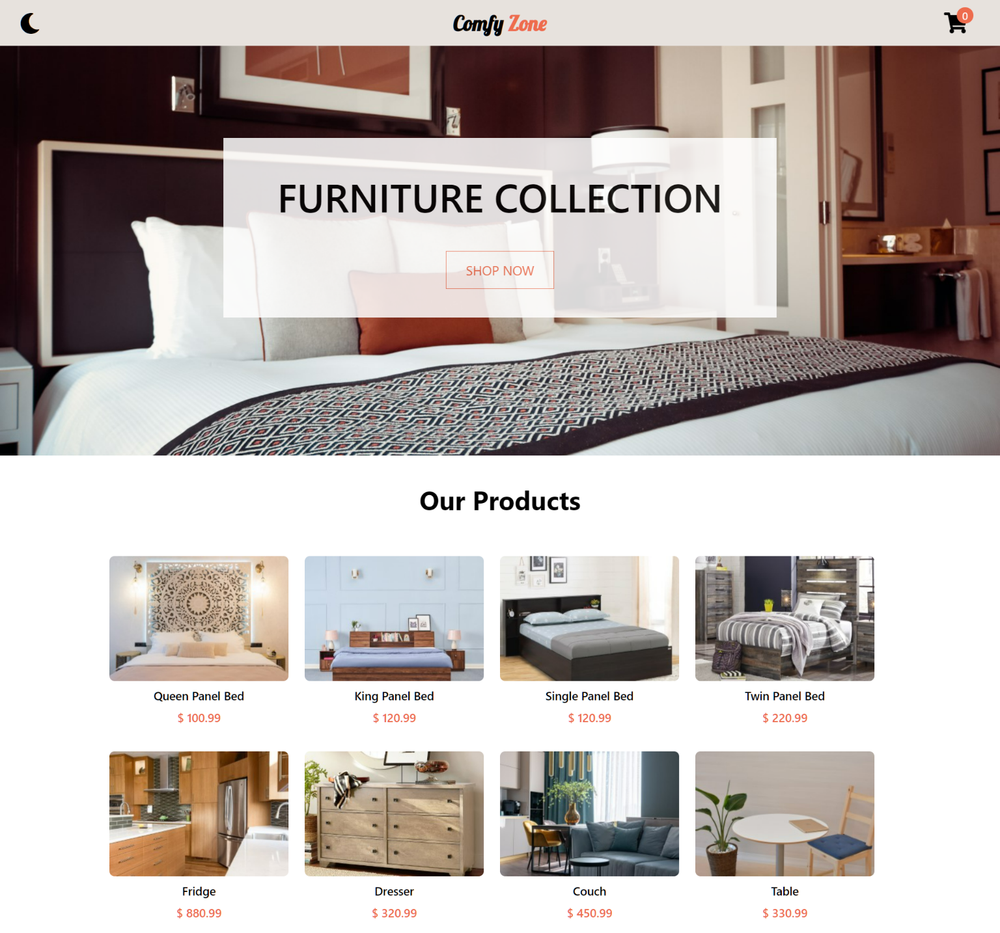
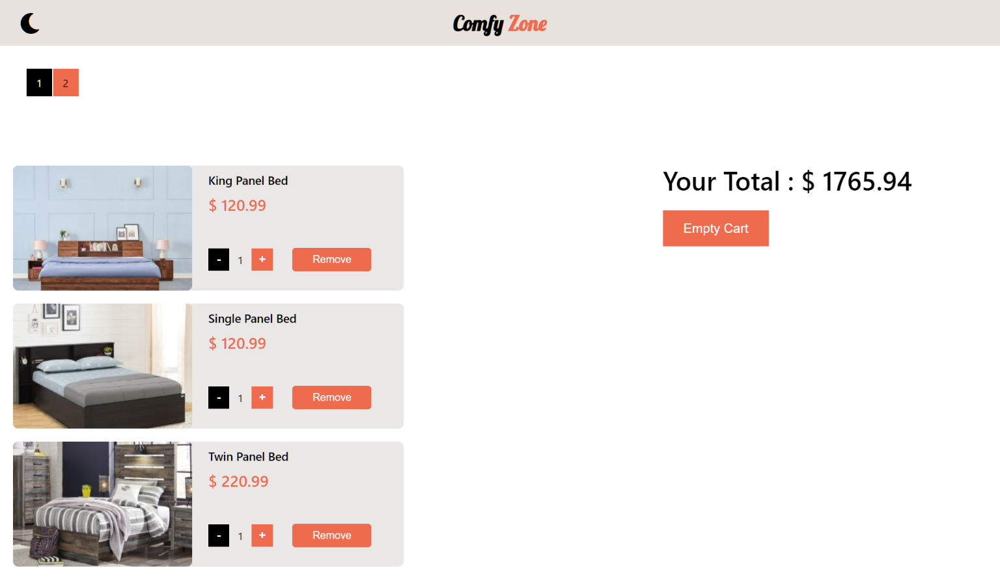

# Comfy Zone

- A basic shopping web application where you can discover product and add it to your cart
- The website is hosted using **'Netlify'** on https://comfy-zone.netlify.app
- Responsive for both desktop and mobile screen

# Technologies used

- I have written the source code in **'React'** and it's libraries and builtin functions
- The libraries that I've used are **'lodash'** and **'react-router-dom'**
- **'lodash'** to paginate the cart items
- **'react-router-dom'** to navigate between pages

# Web-App

### Homepage (light)

---

### Homepage (dark)

.png>)

---

### Cart Items (light)

---

### Cart Items (dark)

.png>)
